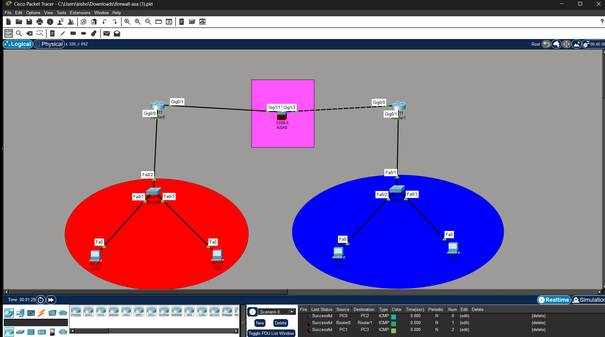

# 🔥 CCNA ASA Firewall Lab

## 📌 Overview

This project demonstrates the configuration of a Cisco ASA firewall to secure communication between two LAN networks using Cisco Packet Tracer. It includes interface configuration, routing, and ACL-based traffic filtering.

---

## 🎯 Objectives

* Configure ASA interfaces (inside/outside)
* Assign IP addresses
* Implement routing
* Apply ACL rules
* Test connectivity

---

## 🧩 Features

* Two LAN networks connected via firewall
* ASA (5506-X) configuration
* Traffic filtering using ACL
* Network security basics

---

## 🛠️ Tools Used

* Cisco Packet Tracer
* Cisco ASA Firewall

---

## 🌐 Network Topology

---

## 📂 Project Structure

ccna-asa-firewall-lab/
│── topology/
│── configs/
│── README.md

---

## 📢 Conclusion

This project demonstrates firewall-based network security and traffic control in a simulated environment.
